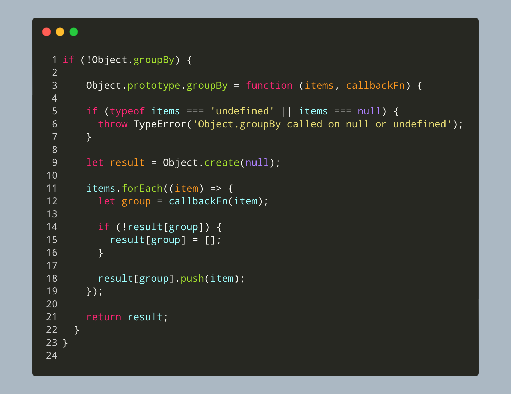

#JavaScriptTidbits

Polyfills: Your JavaScript Time Machines

Imagine you’re crafting a sleek, modern web app. Everything’s perfect—until you realize some users are on ancient browsers that don’t support your shiny new features. It’s like building a high-tech home, only to discover some guests still use rotary phones.

This is where a polyfill comes in. A polyfill is a bit of code that acts like a time machine. It brings the past up to speed with the present, making old browsers understand modern JavaScript features. It’s not about rewriting everything; it’s about adding what’s missing—like fitting a classic car with a modern engine.

Picture this: you’ve found a new JavaScript feature that makes your code elegant and efficient. But, there’s a catch—some users are stuck on Internet Explorer. A polyfill is your secret weapon. It mimics the new feature for older browsers, ensuring everyone enjoys the same smooth experience.

Polyfills respect the old while embracing the new. They keep your project forward-looking without leaving anyone behind. So, next time you hit a compatibility snag, remember: a polyfill can bridge the gap. It’s a small addition with a big payoff, ensuring your innovation shines through, no matter what.

---

Here’s a polyfill for the `Object.groupBy` method, a gem from the ES 2024 version of JavaScript.

This method is your go-to for turning a chaotic array into organized groups with just one line of code.

Google Chrome jumped on board with this feature back in September 2023, but Safari only caught up recently, in March 2024.

So, if you’ve written some code that uses this nifty method and you need it to work seamlessly in Safari, this polyfill is your lifeline. It’s the bridge that keeps your code running smoothly, no matter the browser.

#javascript #polyfills #es2024 #googlechrome #safari

