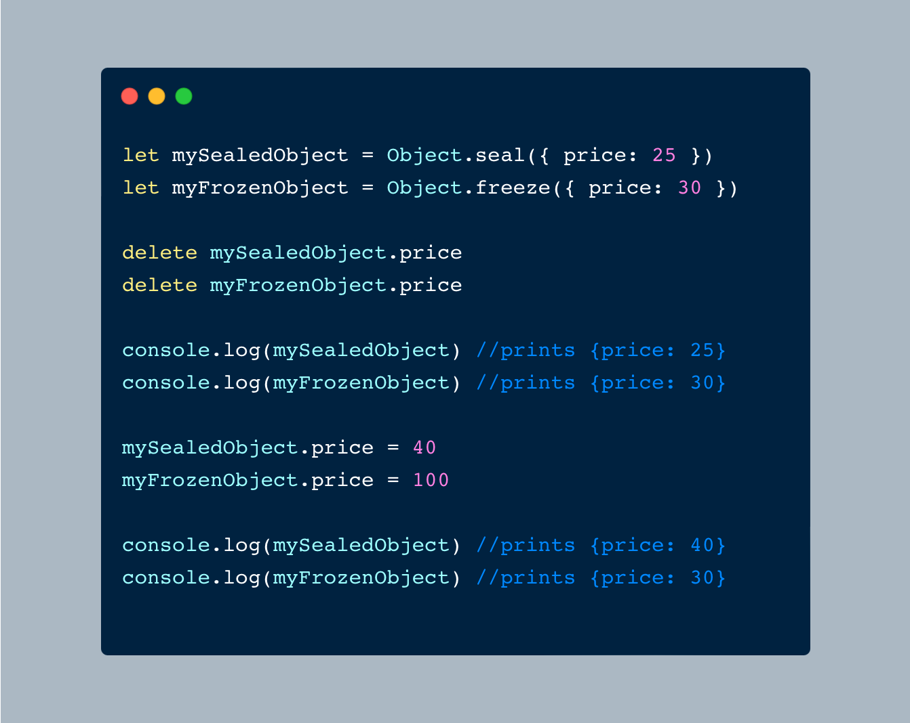

### Seal It or Freeze It? A JavaScript Tale

In a bustling workshop of ideas and code, JavaScript objects were the clay—malleable, ready to be shaped into anything the mind could conceive. Developers sculpted these objects daily, adding a property here, tweaking a method there, always refining.

One day, a seasoned developer named Alex found themselves in a dilemma. They had crafted a perfect object, a masterpiece of functionality and form. But now, it needed stability, a way to ensure it wouldn’t be changed carelessly.

Alex pondered, then remembered two powerful spells: `Object.seal()` and `Object.freeze()`. These weren’t just tools; they were magic for safeguarding creations.

`Object.seal()`: Alex first considered this spell. It was like placing the object in a beautiful glass display case. The contents could still be adjusted and refined, but nothing new could be added, and nothing old could be removed. It was as if Alex was saying, “This set of tools is just right. We can tweak, but no more additions or subtractions.” The object remained flexible yet secure.

`Object.freeze()`: Then there was the stronger spell. This one encased the object in a solid block of ice, preserving every detail. No changes, no additions, no deletions. It was perfect, just as it was. Alex imagined saying, “This creation is flawless. It needs no further adjustments.” The object was locked, solid and unchanging.

In the end, it was about what Alex needed. For some projects, the glass case of `Object.seal()` offered the right balance of stability and flexibility. For others, the icy permanence of `Object.freeze()` ensured absolute preservation.

So, Alex chose wisely, understanding the power of each spell. And in doing so, they kept their JavaScript creations exactly as envisioned, secure and enduring in a world of constant change.

---

Would you rather look at some code instead of a weird-ass tale? 😅

I've got you covered!

Peep the example in the following screenshot 👇

Still not getting it?

Give it a spin in your browser's console.

